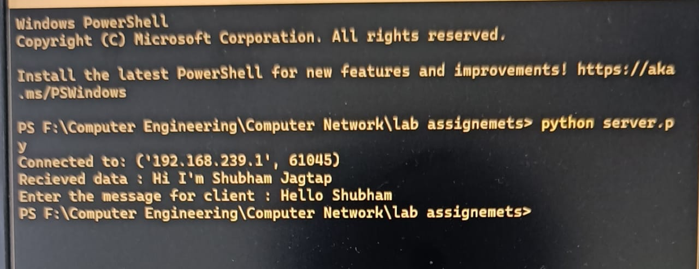
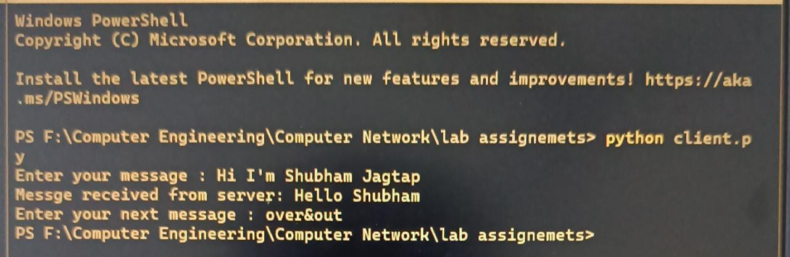

# Client-Server

<h2>Build a simple client-server system, where you use the client to chat with a server. The protocol between the client and server is as follows.</h2>
  
1.The server is first started on a known port.

  
2.The client program is started (server IP and port are provided on the command line).

  
3.The client connects to the server and then asks the user for input.

  
4.The user types his message on the terminal.

  
5.The user's input is sent to the server via the connected socket.

  
6.The server reads the user's input from the client socket.

  
7.The client then reads the reply from the server.

  
8.The server must reply to the client.

  
9.The client asks the user for the next message to send to the server.

  </img>
  </img>
